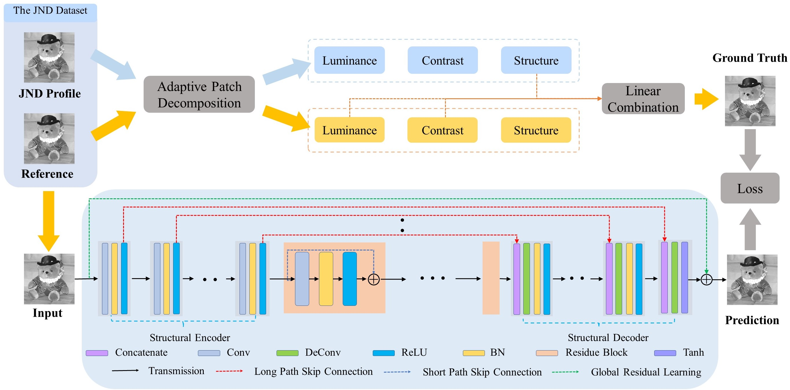

# Introdcurion

This website shares the codes and the dataset of the "Just Noticeable Distortion Profile Inference: A Patch-level Structural Visibility Learning Approach", TIP-2020.

**Abstract:**

In this paper, we propose an effective approach to infer the just noticeable distortion (JND) profile based on patch-level structural visibility learning. Instead of pixel-level JND profile estimation, the image patch, which is regarded as the basic processing unit to better correlate with the human perception, can be further decomposed into three conceptually independent components for visibility estimation. In particular, to incorporate the structural degradation into the patch-level JND model, a deep learning-based structural degradation estimation model is trained to approximate the masking of structural visibility. In order to facilitate the learning process, a JND dataset is further established, including 202 pristine images and 7878 distorted images generated by advanced compression algorithms based on the upcoming Versatile Video Coding (VVC) standard. Extensive experimental results further show the superiority of the proposed approach over the state-of-the-art.

**The framework of  DNN based structural visibility learning model:**



## Requirements and Installation
We recommended the following dependencies.
*  Python 3.6
*  PyTorch 1.4.0


## Usage
I am really sorry for the delay, the code has been uploaded now. For your usage, please follow the following steps: 

1. Copy your test images to ‘./Test_images’

2. Run 'Generate_testpatch.m' to crop your test images into patches;(Matlab Code)
 
3. Run the learning based structural infer model (Pytorch)

       a. Modify the 'test.csv' at folder ".\ structural _infer\data\" accoding to the number of generated patches

       b. Usage: python main.py -- mode test 

       c. The inferred patches will be at ".\ structural _infer\results\JND\test\"

 4. Run 'Patch_JND.m' to generate JND images and calculate PSNR


## Citation

If our work is useful for your research, please cite our paper:

```
@article{shen2020just,
  title={Just Noticeable Distortion Profile Inference: A Patch-Level Structural Visibility Learning Approach},
  author={Shen, Xuelin and Ni, Zhangkai and Yang, Wenhan and Zhang, Xinfeng and Wang, Shiqi and Kwong, Sam},
  journal={IEEE Transactions on Image Processing},
  volume={30},
  pages={26--38},
  year={2020},
  publisher={IEEE}
}
```

## Contact

Thanks for your attention! If you have any suggestion or question, feel free to leave a message here or contact Xuelin Shen (xuelishen2-c@my.cityu.edu.hk).

 
